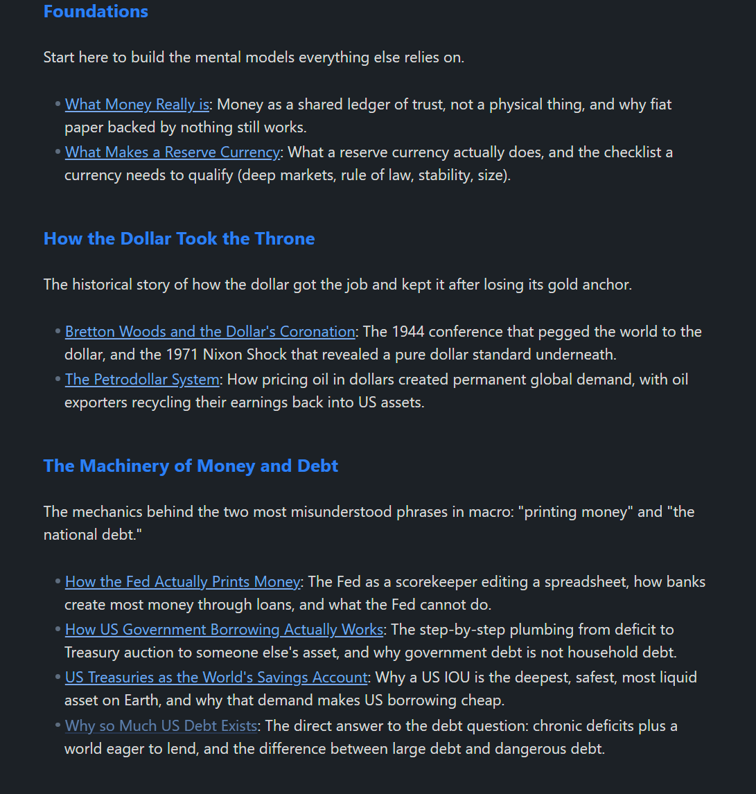
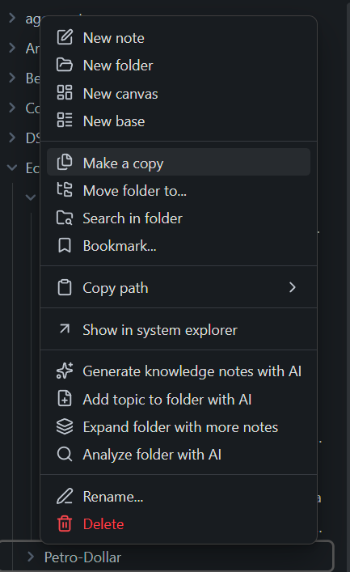
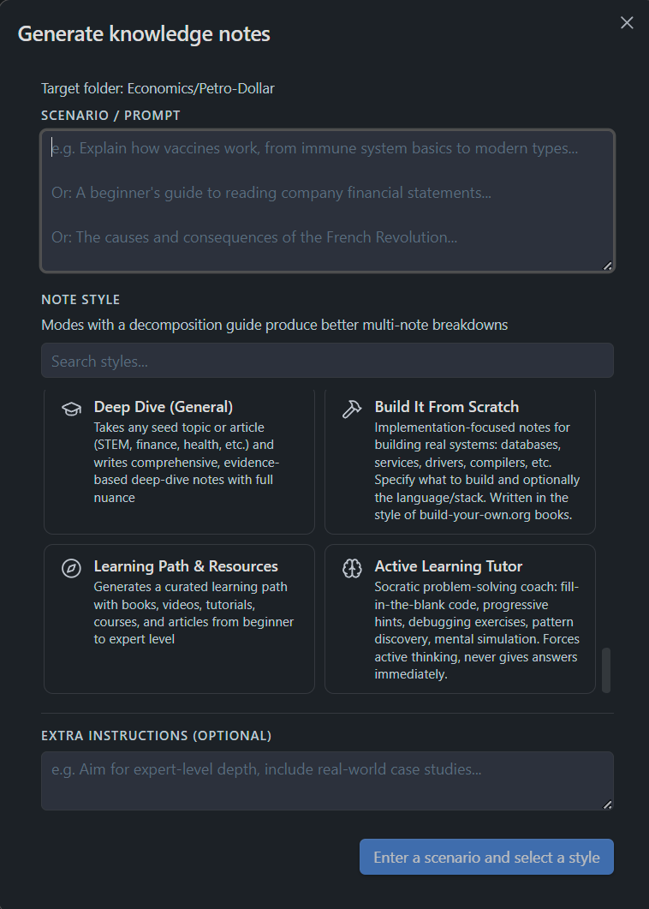
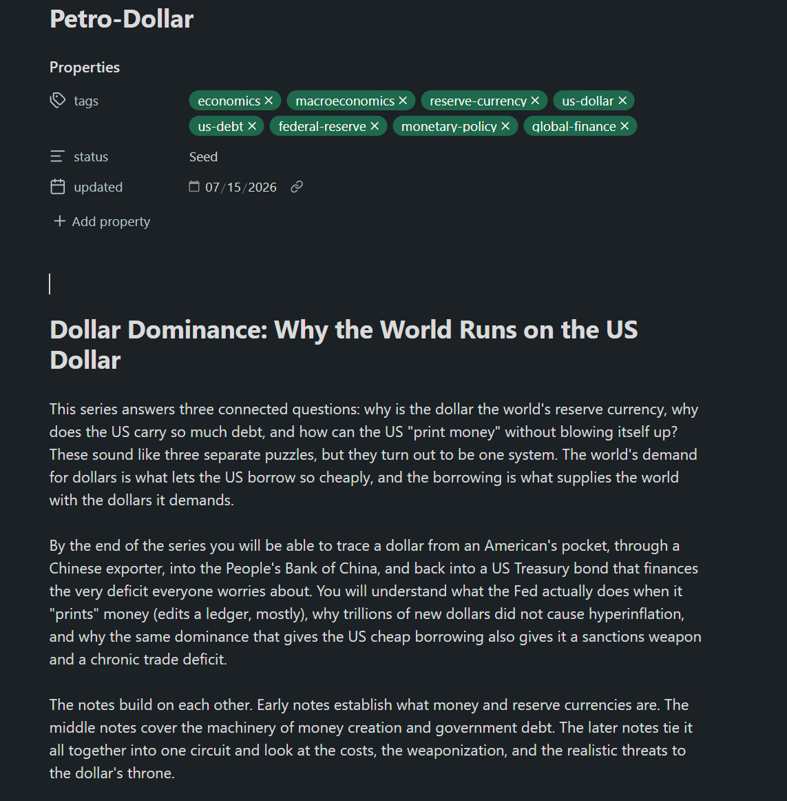
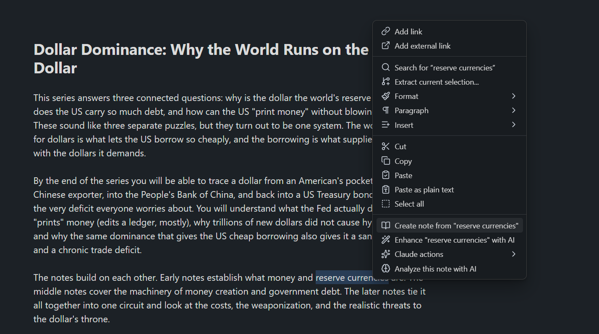
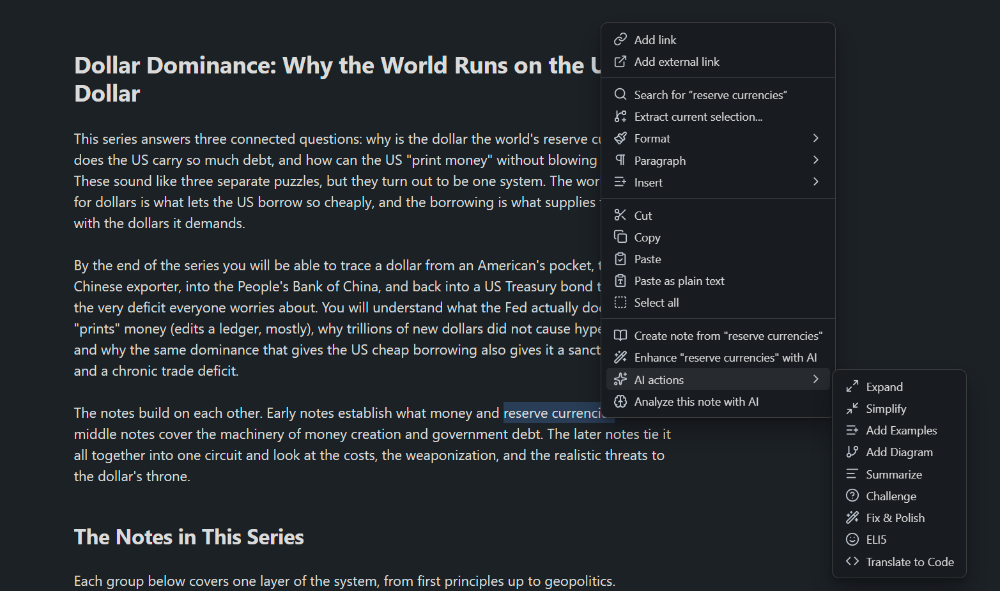

# Second Brain Builder (Obsidian Plugin)


Turn any topic into a folder of interlinked, deep-dive study notes: a generated index hub, mermaid concept maps, and wiki-links that light up Obsidian's graph view. Powered by an AI CLI (Claude Code, Gemini, or Codex) or a fully local Ollama model. It also explains selections into linked notes and enhances text in place. Desktop only. Works on Windows, macOS, and Linux.

One prompt ("why is the dollar the world's reserve currency?") produced this index hub and the 16 linked notes behind it:




## Quick Start

Four steps from zero to your first generated note. Each step links to a detailed section below if you get stuck.

1. **Install the plugin.**
   - *From Obsidian (recommended, once listed in the community directory):* Settings → Community plugins → Browse → search **Second Brain Builder** → Install → Enable.
   - *From GitHub:* clone the repo and run the installer (needs [Node.js](https://nodejs.org) 16+):

     ```bash
     git clone https://github.com/algometrix/second_brain_builder.git
     cd second_brain_builder
     ```

     Windows: double-click `install.bat`. macOS / Linux: run `./install.sh`. Then enable it under Settings → Community plugins. See [Installation](#installation) for the manual route.
2. **Set up one AI backend.** The plugin generates nothing until this is done. The two easiest options:
   - *Cloud (best quality):* install [Node.js](https://nodejs.org) 16+, then `npm install -g @anthropic-ai/claude-code`, then run `claude` once to log in. Needs a Claude account.
   - *Local (free, private):* install [Ollama](https://ollama.com) and run `ollama pull llama3`. No account or Node.js needed.

   All options are covered in [Setting Up an AI Backend](#setting-up-an-ai-backend), and the plugin's settings tab shows the same steps for whichever provider you select.
3. **Pick your provider:** open Settings → Second Brain Builder and set **AI provider** to the backend you set up (Claude is the default). The setup guide for that provider appears right below the option.
4. **Generate your first note:** open any note, select a word or phrase, press `Ctrl+P` (macOS: `Cmd+P`), run **"Explain selection with AI"**, and pick the **Explain** mode. A new linked note appears in the same folder. Then try the headline feature: run **"Generate knowledge notes in folder with AI"**, type any topic, and watch it build a whole linked series with an index and diagrams.

If the plugin says it cannot find the CLI, see [Troubleshooting](#troubleshooting); it is almost always a PATH issue with a one-line fix.

## Features and When to Use Them

### Generate Knowledge Notes in Folder

Give the plugin a topic, a pasted paragraph, or a whole article, pick a teaching mode and a target folder, and it builds a complete, interlinked mini-textbook. Run it from the command palette (**"Generate knowledge notes in folder with AI"**) or by right-clicking a folder:



Describe what you want to learn and pick a note style:



A few minutes later the folder contains the full series. Each note has YAML frontmatter, tags, and cross-links to its siblings:



Here is what happens under the hood:

1. **Planning.** The AI acts as a curriculum designer and decomposes your scenario into 8 to 15 self-contained concept notes, ordered from foundational to advanced. Each planned note gets a title, a defined scope, and a list of related notes in the series. Modes can carry a `folderDecompositionGuide` that teaches the planner how to split topics in that domain, so the breakdown is not generic.
2. **Index hub.** A hub note named after the folder is generated first. It contains an overview of the topic, every note in the series as a `[[wiki-link]]` grouped logically with one-line descriptions, a recommended reading order with rationale, and a **mermaid diagram** (with subgraphs) mapping how the notes relate to each other.
3. **The notes themselves.** Each note is then written in your chosen mode's style, one queue item at a time. Every note knows its siblings: it receives the full series plan and its own scope, and is instructed to cross-link related notes with `[[wiki-links]]` where relevant. Notes use mermaid diagrams, tables, and Obsidian callouts throughout, and every one gets YAML frontmatter and consistent formatting via the plugin's output rules.
4. **The graph effect.** Because the hub links to every note and the notes link to each other, the folder appears in Obsidian's graph view as a connected cluster around the hub, not a pile of orphan files.
5. **Safe to re-run.** Existing notes with content are skipped and empty stubs are filled in, so you can re-run the command on the same folder to resume an interrupted batch or extend the series.

Use this when you want to learn a new subject properly: one command turns "explain how the global oil market works" or a pasted article into a structured, linked course you can read in order or explore through the graph.

### Explain Selection (note creation)

Select a word or phrase, run **"Explain selection with AI"** (or right-click the selection), and pick one or more modes. The plugin creates a new note in the same folder, writes the AI output into it, and replaces your selection with a `[[wiki-link]]`. If a note with that name already exists, it links to it instead. You can select several modes at once to generate multiple takes on the same topic.



Use this when a term deserves its own note and you want your vault to grow into a linked knowledge base while you read.

### Enhance Selection (inline actions)

Run **"Enhance selection with AI"** to transform the selected text in place, or insert the result below it. All nine actions are also one right-click away under **AI actions**:



| Action | Use it when |
|---|---|
| **Expand** | A passage is too thin and needs more depth, without creating a new note |
| **Simplify** | The text is dense or jargon-heavy |
| **Add Examples** | An abstract explanation needs concrete cases |
| **Add Diagram** | A process or structure would be clearer as a mermaid diagram |
| **Summarize** | A long section needs a TL;DR |
| **Challenge** | You want counterarguments and weaknesses of the claims |
| **Fix & Polish** | Grammar, flow, and clarity need cleanup without changing meaning |
| **ELI5** | You want a beginner-level restatement |
| **Translate to Code** | A described algorithm or process should become working code |

Use inline actions to improve the note you are in. Use note creation to grow the vault.

### Analyze Current Note

**"Analyze current note with AI"** runs a full-note mode (marked `fullNote` in the modes file) against the entire note and appends the result. The sample modes include **Question Generator** (appends review questions) and **Active Recall Prep** (creates fill-in-the-gap exercises).

Use this after finishing a note, when you want study aids or a critique of the whole thing rather than one selection.

### Generate Notes from Topic

**"Generate notes from topic with AI"** creates notes from a typed topic, no selection needed. It can decompose a broad topic into multiple linked notes.

Use this to bootstrap a new subject from nothing.

### Fill Empty Note

**"Fill empty note with AI"** fills the note you are in, using its title and backlink context as the prompt.

Use this when you created stub `[[links]]` earlier and want to flesh them out one by one.

### System Design Utilities

- **"Insert scale estimation table"** inserts a back-of-envelope capacity estimation table at the cursor.
- **"Scaffold system design workspace"** creates a linked workspace of section notes for a design exercise.

Use these if you keep system design or interview prep notes.

### Queue, Status Bar, and Logs

All generation runs through a sequential background queue, so you can queue several notes and keep working.

- The **status bar** shows the current item and queue length.
- **"View note generation queue"** opens a live progress modal with elapsed time, retry, remove, and streaming output (CLI providers; Ollama output appears when generation completes).
- **"View logs"** shows recent plugin activity for debugging.

## Requirements

- Obsidian on desktop (Windows, macOS, or Linux). The plugin is desktop only because it spawns local processes.
- At least one AI backend from the next section. Installing the plugin is not enough by itself; nothing generates until a backend is set up.
- Node.js 16+ and npm, but only if you use a CLI backend (Claude, Gemini, Codex) or install the plugin from GitHub. Ollama users installing from the community directory do not need Node.

## Setting Up an AI Backend

Pick one provider in **Settings → Second Brain Builder → AI provider**. All four work on Windows, macOS, and Linux.

### Claude Code CLI (default)

```bash
npm install -g @anthropic-ai/claude-code
claude          # run once in a terminal to log in
```

The plugin calls the CLI in read-only mode with file-modifying tools disabled.

> **Note:** the plugin invokes `claude -p` (print mode). Anthropic has announced (currently paused) plans to bill programmatic usage like `claude -p` separately from Pro/Max subscription limits, as extra usage at API rates. If that change ships, plugin usage may no longer be covered by your plan. Also note that generating notes can consume a lot of tokens, especially with large selections or batch generation, so watch your usage limits.

### Gemini CLI

```bash
npm install -g @google/gemini-cli
gemini          # run once to log in
```

The plugin runs Gemini with `--approval-mode plan`, so it cannot modify files.

### OpenAI Codex CLI

```bash
npm install -g @openai/codex
codex login
```

The plugin runs `codex exec --sandbox read-only` and captures the final message via a temp file, since Codex interleaves progress logs on stdout.

### Ollama (local, private)

Install Ollama from [ollama.com](https://ollama.com) (installers for all three OSes), then:

```bash
ollama pull llama3     # or any model you prefer
```

Keep Ollama running, set the provider to **Ollama**, and set the model name in settings. The default URL is `http://localhost:11434`.

Use Ollama when your notes must never leave your machine or you do not want a subscription. The cloud CLIs generally produce better notes; local quality depends on the model you pull.

## Installation

### Option A: From Obsidian (recommended)

Once the plugin is available in the community directory:

1. Open **Settings → Community plugins → Browse**.
2. Search for **Second Brain Builder**, click **Install**, then **Enable**.
3. Open **Settings → Second Brain Builder** and follow the setup guide for your chosen AI backend (see [Setting Up an AI Backend](#setting-up-an-ai-backend)).

No terminal or Node.js is needed for this route unless you pick a CLI backend.

### Option B: From GitHub (installer script)

Clone the repo, then:

- **Windows:** run `install.bat`
- **macOS / Linux:** run `./install.sh`

Both build the plugin and auto-detect your vaults from Obsidian's config, with a manual path prompt as fallback. Requires Node.js 16+.

### Option C: From GitHub (manual)

```bash
npm install
npm run build
```

Then copy `main.js`, `manifest.json`, and `styles.css` into your vault:

| OS | Typical destination |
|---|---|
| Windows | `C:\Users\<you>\Documents\MyVault\.obsidian\plugins\second-brain-builder\` |
| macOS | `~/Documents/MyVault/.obsidian/plugins/second-brain-builder/` |
| Linux | `~/Documents/MyVault/.obsidian/plugins/second-brain-builder/` |

### Enable the plugin

1. Open **Settings → Community plugins** and turn off Restricted mode if needed.
2. Refresh installed plugins and toggle **Second Brain Builder** on.
3. Recommended: assign a hotkey to "Explain selection with AI" under **Settings → Hotkeys**.

## Note Modes

Modes define the teaching styles offered in the note creation modal. They live in `modes.json`, which is bundled into the plugin at build time.

`modes.json` is **not** committed to the repository. It is resolved before every build by `scripts/sync-modes.js`:

1. If `modes.config.json` exists, its `modesFile` is copied to `modes.json`.
2. Otherwise, an existing `modes.json` is used as-is.
3. Otherwise, `modes.sample.json` is copied to `modes.json`.

A fresh clone builds with the sample modes and needs no setup. To maintain your own modes:

```bash
cp modes.sample.json modes.personal.json     # then edit it
```

Create `modes.config.json`:

```json
{
  "modesFile": "modes.personal.json"
}
```

Rebuild. Both files are gitignored, so your prompts stay private. You can also add custom modes in the plugin settings without rebuilding; those are stored in the vault's plugin data.

### Mode schema

| Field | Required | Meaning |
|---|---|---|
| `id` | yes | Unique identifier |
| `name` | yes | Shown in the mode picker |
| `icon` | yes | A [Lucide](https://lucide.dev) icon name |
| `description` | yes | One-line summary shown in the picker |
| `prompt` | yes | The system prompt. `{selection}` and `{context}` are replaced at run time |
| `isDefault` | no | Preselect this mode |
| `fullNote` | no | Mode operates on the whole note (used by "Analyze current note") and `{context}` is the full note content |
| `folderDecompositionGuide` | no | Guides how folder generation splits the topic into notes |
| `analyzesExisting` | no | Mode analyzes existing content rather than generating new content |

### Sample modes

`modes.sample.json` ships 23 general-purpose modes:

| Mode | Best for |
|---|---|
| Explain | Default detailed reference note |
| Deep Inquiry | Critical analysis, trade-offs, stress tests |
| Feynman Teacher | Intuition-first teaching with analogies |
| Book Summarizer | Chapter-by-chapter book notes |
| Researcher | Evidence, competing perspectives, open questions |
| Flashcard Maker | Q&A cards for spaced repetition |
| Compare & Contrast | Side-by-side comparison of options |
| Cheat Sheet | Condensed quick reference |
| Socratic Guide | Question-driven exploration |
| Cornell Notes | Cues, notes, and summary layout |
| Glossary Builder | Term definitions and relationships |
| Debate | Arguing all sides of a question |
| How-To Guide | Step-by-step practical instructions |
| Mind Map | Hierarchical concept map |
| ELI5 | Absolute-beginner explanation |
| Timeline | Chronological history of a concept |
| Devil's Advocate | Challenging assumptions |
| Project Breakdown | Phases, tasks, and milestones |
| Case Study | Real-world case analysis |
| Question Generator (full note) | Appending review questions to a finished note |
| Active Recall Prep (full note) | Fill-in-the-gap study exercises |
| Deep Dive (General) | Long-form, evidence-based deep dives |
| Learning Path & Resources | Curated beginner-to-expert learning paths |

## Settings

| Setting | Description | Default |
|---|---|---|
| AI provider | `claude`, `gemini`, `codex`, or `ollama` | `claude` |
| Claude CLI path | Path to the `claude` executable | `claude` |
| Claude model | Optional model override | *(CLI default)* |
| Gemini CLI path / model | Same, for Gemini | `gemini` / *(default)* |
| Codex CLI path / model | Same, for Codex | `codex` / *(default)* |
| Ollama URL / model | Local API endpoint and model name | `http://localhost:11434` / `llama3` |
| Default mode | Mode preselected in the picker | *(first default)* |
| Enable logging | Keep an in-memory log for "View logs" | on |
| Custom modes | Add or edit modes without rebuilding | *(none)* |

## Vault Fix Scripts

LLMs occasionally emit markdown that Obsidian renders badly, mostly around mermaid diagrams and callouts. The `scripts/` folder contains standalone fixers that scan every `.md` file in a vault, report problems, and optionally repair them.

All scripts take the vault path as the first argument (or the `OBSIDIAN_VAULT` environment variable) and are detect-only unless you pass `--fix`:

```bash
node scripts/fix-all.js "/path/to/YourVault"          # detect only, all fixers
node scripts/fix-all.js "/path/to/YourVault" --fix    # apply all fixes
node scripts/fix-mermaid-end.js "/path/to/YourVault"  # run a single fixer
```

| Script | Fixes |
|---|---|
| `fix-all.js` | Runs every fixer below in the correct order |
| `fix-callout-fences.js` | Code fences inside callouts missing the `> ` prefix |
| `fix-currency-dollars.js` | Unescaped `$` currency signs that Obsidian reads as LaTeX |
| `fix-mermaid-end.js` | Extra `end` keywords with no matching block opener |
| `fix-mermaid-missing-end.js` | Missing `end` keywords and closing fences not on their own line |
| `fix-split-end.js` | Words like "Send" split across lines by an old regex bug |
| `fix-mermaid-parens.js` | Unquoted mermaid node labels containing parentheses or slashes |
| `fix-mermaid-quotes.js` | Nested double quotes inside quoted mermaid labels |
| `fix-mermaid-list.js` | "Unsupported markdown: list" errors in mermaid labels |

Run `fix-all.js` without `--fix` after a large batch generation, or when a mermaid block in your vault shows a syntax error. Review the report, then re-run with `--fix`. Back up your vault (or commit it) before applying fixes in bulk.

## Privacy

The selected text and surrounding note content are sent to whichever backend you configure. With Claude, Gemini, or Codex, that means the respective cloud API, under your own account and their terms. With Ollama, everything stays on your machine. The plugin itself collects nothing.

## Security

The plugin spawns the AI CLI you configure, which is why Obsidian shows a "shell execution" notice for it. The design limits what that process can do:

- Note content is passed to the CLI via stdin, never interpolated into a shell command line.
- Each CLI runs in a restricted mode: Claude with `--disallowedTools` (no file edits, no shell), Gemini with `--approval-mode plan`, Codex with `--sandbox read-only`.
- Only the executable path and model name from your own settings are used to build the command; the plugin never runs commands supplied by note content or by the model's output.
- All generated content is written through Obsidian's vault API, not directly to disk.

## Development

```bash
npm install
npm run dev     # watch mode, rebuilds on save
```

Use the [Hot-Reload plugin](https://github.com/pjeby/hot-reload) for instant reloads in Obsidian. Source lives in `src/` (entry point `src/main.ts`), bundled to `main.js`.

## Troubleshooting

| Problem | Fix |
|---|---|
| "command not found" / spawn error | Put the absolute CLI path in settings. Find it with `where claude` (Windows) or `which claude` (macOS/Linux) |
| CLI works in terminal but not in Obsidian (macOS/Linux) | Apps launched from the dock do not inherit your shell PATH. Use the absolute path in settings, e.g. `/usr/local/bin/claude` or `~/.nvm/versions/node/<ver>/bin/claude` |
| Windows path | npm installs usually land at `C:\Users\<you>\AppData\Roaming\npm\claude.cmd` |
| Empty or garbled output | Verify the CLI works standalone first, e.g. `claude -p "hello"` |
| Ollama errors | Check the server is running: `curl http://localhost:11434` and that the model is pulled |
| Timeout | Large contexts are slow; select less text or use a faster model |
| Build fails on `modes.json` | Run `node scripts/sync-modes.js`, or check that the path in `modes.config.json` exists |

## License

[MIT](LICENSE)
